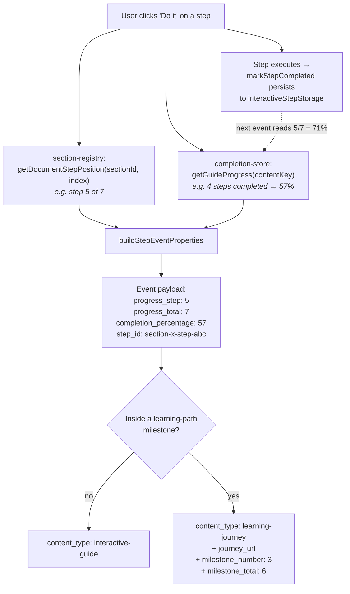
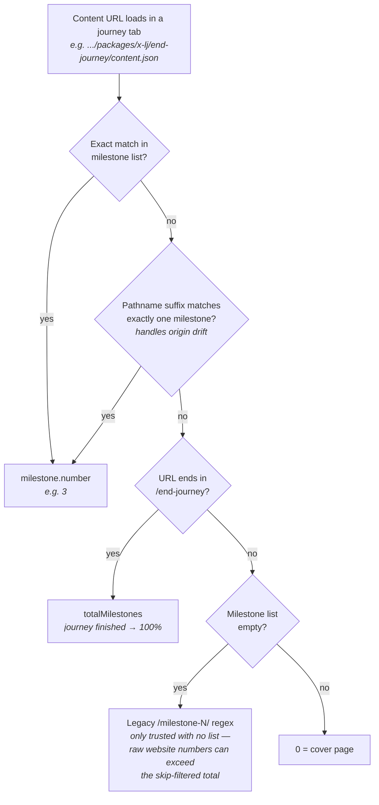
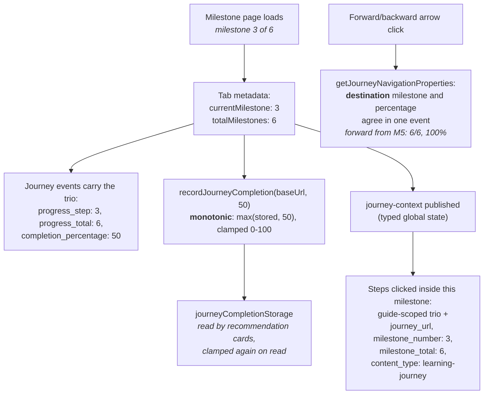
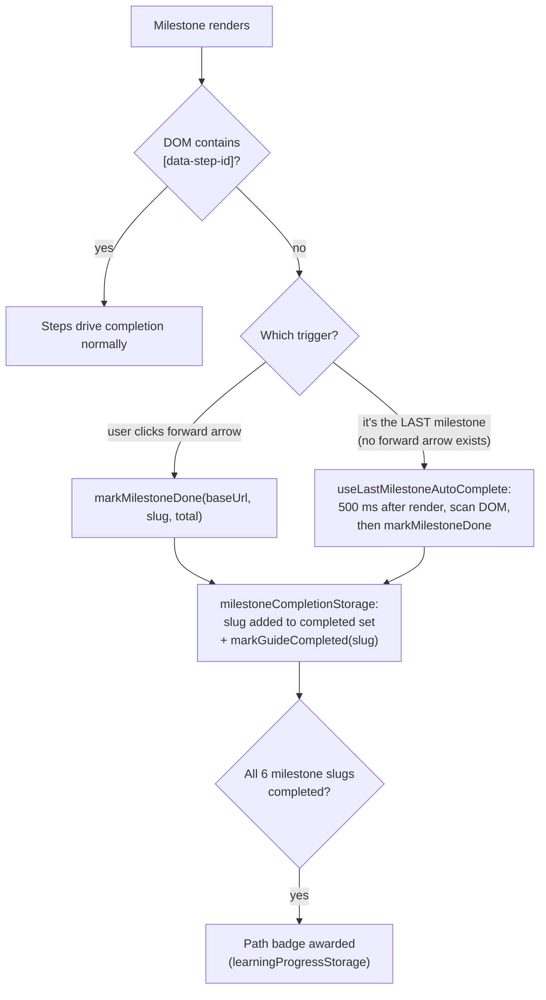

# Completion metrics

How Pathfinder computes and reports progress for **interactive guides** and **learning paths** (journeys), as of the progress-standardization PR (#1370). Covers the analytics events, the persisted storage, and the edge cases (milestones with no interactive steps, all-passive guides, end-journey pages, revisits).

Every progress-bearing analytics event carries one canonical numeric trio:

| Field                   | Interactive guide                                                                 | Learning path (journey)                                              |
| ----------------------- | --------------------------------------------------------------------------------- | -------------------------------------------------------------------- |
| `progress_step`         | 1-indexed document position of the step/section acted on                          | Milestone number (0 = cover page; destination on arrow clicks)       |
| `progress_total`        | Total interactive steps in the guide                                              | Milestones in **Pathfinder's own list** (never the website's count)  |
| `completion_percentage` | **Completed steps** ÷ total, from the completion store (monotonic, clamped ≤ 100) | round(milestone ÷ total × 100) — position-based                      |
| `content_type`          | `interactive-guide`                                                               | `learning-journey` — including step clicks _inside_ a path milestone |

String identity lives in dedicated fields (`step_id`, `section_id`, `section_title`), never in the numeric columns. The downstream warehouse view maps `progress_step` → step_clicked, `progress_total` → total_length, `completion_percentage` → view_percentage (gate on `plugin_version`).

## Interactive guides

Two independent measures exist, and they intentionally answer different questions:

- **Position** (`progress_step` / `progress_total`): _where in the guide is the thing the user just clicked?_ Comes from `section-registry.ts` (`getDocumentStepPosition`), which sums step counts across all sections.
- **Completion** (`completion_percentage`): _how much of the guide has the user actually finished?_ Comes from `completion-store.ts` (`getGuideProgress(contentKey)`), which counts persisted completed steps. Resolved **at event time** in `step-analytics.ts`, so it never goes stale — and never decreases when a user re-runs an earlier step.

### Walkthrough: a 7-step guide (one step per section, like `irm-configuration`)

| #   | User action                       | `progress_step` / `progress_total` | `completion_percentage` | Why                                                                                                                                           |
| --- | --------------------------------- | ---------------------------------- | ----------------------- | --------------------------------------------------------------------------------------------------------------------------------------------- |
| 1   | "Do it" on step 1                 | 1 / 7                              | 0                       | Nothing completed yet at click time; the step persists as completed _after_ it executes                                                       |
| 2   | "Do it" on step 2                 | 2 / 7                              | 14                      | 1 of 7 completed (step 1)                                                                                                                     |
| 3   | "Do it" on step 5 (skipped ahead) | 5 / 7                              | 29                      | Position is where they clicked; completion is what's actually done (2 of 7)                                                                   |
| 4   | "Do it" on step 7                 | 7 / 7                              | 43                      | 3 of 7 completed before this click                                                                                                            |
| 5   | **Re-runs step 2**                | 2 / 7                              | 57                      | Position drops back to 2 — but completion never decreases. Pre-fix this event reported 29% and analytics looked like the user "lost" progress |

### Walkthrough: "Do section" (`do_section_button_click`)

A section run reports **both scopes**, with distinct names so they can't be coalesced:

| Field                                                 | Example                   | Meaning                                                                                         |
| ----------------------------------------------------- | ------------------------- | ----------------------------------------------------------------------------------------------- |
| `section_id` / `section_title`                        | `section-send-demo-alert` | Which section ran                                                                               |
| `section_total_steps`                                 | 1                         | Steps in _this section_ (the old ambiguous `total_steps`)                                       |
| `current_section_step` / `current_section_percentage` | 1 / 100                   | Steps completed within the section this run                                                     |
| `progress_step` / `progress_total`                    | 6 / 7                     | Document position of the last completed step                                                    |
| `completion_percentage`                               | 86                        | Guide-wide completed steps (fires after the section's steps persist)                            |
| `canceled`                                            | false                     | `true` if the user cancelled mid-run — the section-scoped counts then show the partial progress |

### Edge case: all-passive guide (zero interactive steps)

`getGuideProgress` falls back to **section acknowledgements**: `completion_percentage` = acknowledged sections ÷ total sections. A 4-section reading-only guide where the user has marked 3 sections done reports 75%.

## Learning paths (journeys)

A path is an ordered list of milestones, and **each milestone is itself a guide** (e.g. `adaptive-logs-lj` → 5 milestone guide packages). Journey-level progress is _position-based_ — milestone N of M — because milestones are linear. The total always comes from Pathfinder's own list (manifest `milestones` array, or the website `index.json` after `grafana.skip` filtering + renumbering), never from raw website milestone numbers.

### How a URL resolves to a milestone number

Pre-fix, the regex ran even when a filtered list existed: the website's `milestone-7` resolved to 7 against a 6-milestone Pathfinder list — the "step 7 of 6" rows in production data. This matters more as intro-text milestones are removed from all learning paths.

### Event and storage flow

### Walkthrough: a 6-milestone path

| #   | User action                                                         | Event                               | Trio (`step`/`total`/`%`)                                                       | Persisted journey completion                                                                       |
| --- | ------------------------------------------------------------------- | ----------------------------------- | ------------------------------------------------------------------------------- | -------------------------------------------------------------------------------------------------- |
| 1   | Opens the path (cover page)                                         | `panel_scroll`                      | 0 / 6 / 0                                                                       | 0                                                                                                  |
| 2   | Clicks "Ready to begin"                                             | `start_learning_journey_click`      | 1 / 6 / 17                                                                      | 17 (milestone 1 loads)                                                                             |
| 3   | Milestone 1 is a 3-step guide; clicks "Do it" on step 2             | `do_it_button_click`                | 2 / **3** / 33 — guide-scoped, plus `milestone_number: 1`, `milestone_total: 6` | 17                                                                                                 |
| 4   | Forward arrow to milestone 2                                        | `milestone_arrow_interaction_click` | 2 / 6 / 33 — destination, not origin                                            | 33                                                                                                 |
| 5   | **Milestone 4 has no interactive steps** (text only); forward arrow | `milestone_arrow_interaction_click` | 5 / 6 / 83                                                                      | 83 — see edge case below                                                                           |
| 6   | Reaches the end-journey page                                        | `panel_scroll`, `close_tab_click`   | 6 / 6 / 100                                                                     | **100** (pre-fix: end-journey resolved to milestone 0 and _overwrote storage with 0%_)             |
| 7   | Later revisits milestone 1                                          | events report 1 / 6 / 17 (position) |                                                                                 | **stays 100** — `recordJourneyCompletion` never lowers; the recommendation card keeps showing 100% |

Pre-fix, step 4's event was internally inconsistent: it logged the _destination_ milestone number but computed the percentage from the _origin_ (milestone 6 of 6 with 83%), and a forward click never reported 100%.

### Edge case: milestone with no interactive steps

Milestones normally complete through their steps. A text-only milestone has nothing to click, so two mechanisms cover it:

So in walkthrough step 5, the forward click both logs the destination trio _and_ marks the text-only milestone 4 done — per-milestone completion advances even though the user never "did" anything on it. Without the last-milestone auto-complete, a journey ending on a passive milestone could never reach a fully-completed state.

### Edge case: historical bad storage values

Old builds persisted position-overwrites (finished journey knocked back to 17% on revisit) and >100% values (raw website milestone numbers ÷ filtered total). New writes are monotonic and clamped; reads (`getJourneyCompletionPercentageAsync`, used by recommendation cards) clamp to 0–100, so historical corruption is masked without a data migration.

## Where each number lives

| Store                                           | Key                                         | Written by                                                                            | Semantics                                                                 |
| ----------------------------------------------- | ------------------------------------------- | ------------------------------------------------------------------------------------- | ------------------------------------------------------------------------- |
| `interactiveStepStorage` (via completion-store) | contentKey → completed step IDs             | `markStepCompleted` on step execution                                                 | Source of guide `completion_percentage`; roster-reconciled, clamped ≤ 100 |
| `sectionAcknowledgementStorage`                 | contentKey → acknowledged sections          | Reader marks a passive section done                                                   | Fallback percentage for all-passive guides                                |
| `journeyCompletionStorage`                      | journey baseUrl → 0–100                     | `recordJourneyCompletion` on milestone load / guide complete                          | **Monotonic + clamped**; feeds recommendation cards                       |
| `milestoneCompletionStorage`                    | journey baseUrl → completed milestone slugs | `markMilestoneDone` (steps, arrow on no-step milestone, last-milestone auto-complete) | Drives the path badge when all slugs complete                             |
| `learningProgressStorage`                       | badges / guide completions                  | `markGuideCompleted`, badge awards                                                    | My learning tab, gamification                                             |
