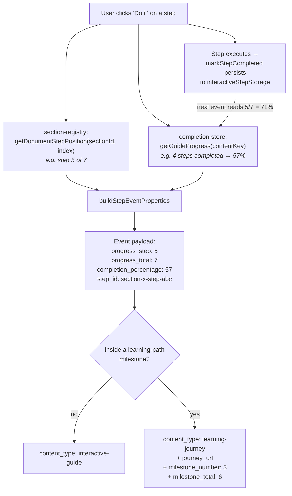
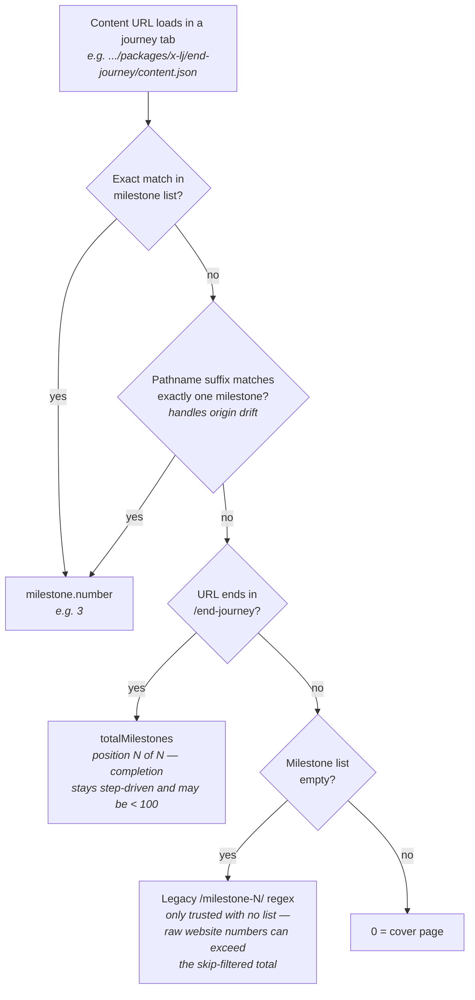
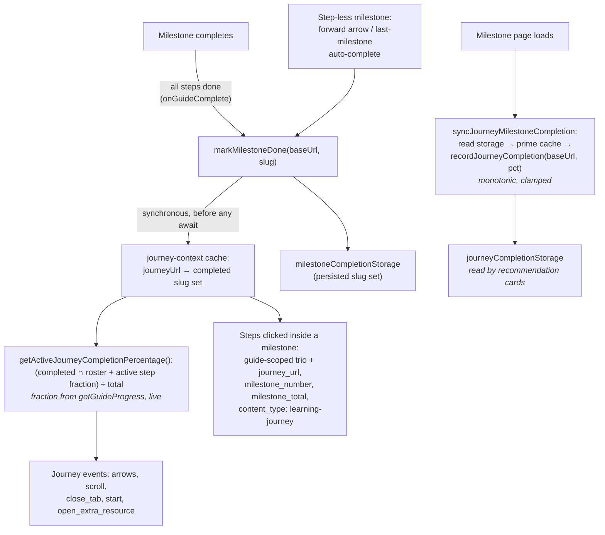
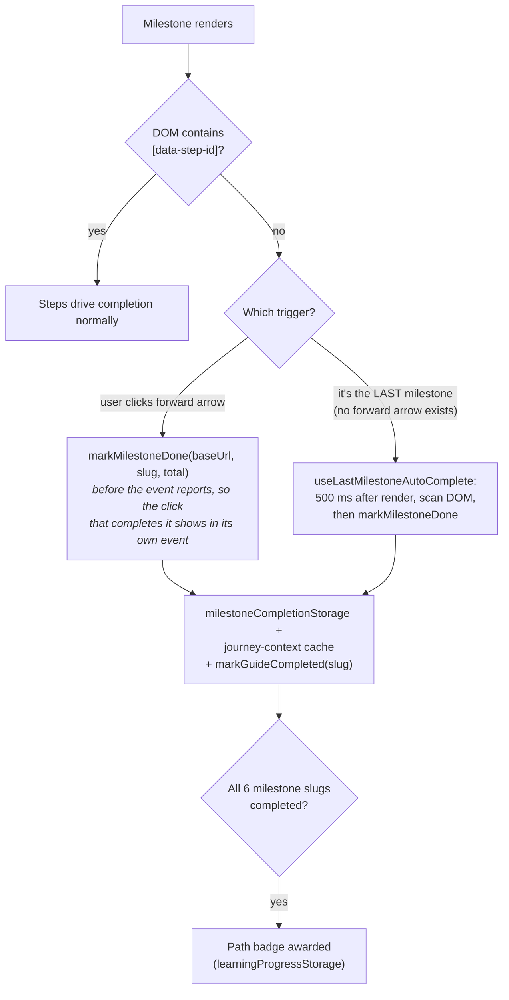

# Completion metrics

How Pathfinder computes and reports progress for **interactive guides** and **learning paths** (journeys), as of the progress-standardization PR (#1370). Covers the analytics events, the persisted storage, and the edge cases (milestones with no interactive steps, all-passive guides, end-journey pages, revisits).

The model is symmetric for both content kinds: **position** tells you where the user is; **completion** tells you what they have actually done. A user can be on the last page with almost nothing completed — the two fields make click-through and real completion distinguishable.

Every progress-bearing analytics event carries one canonical numeric trio:

| Field                   | Interactive guide                                                                 | Learning path (journey)                                                                                                                                                        |
| ----------------------- | --------------------------------------------------------------------------------- | ------------------------------------------------------------------------------------------------------------------------------------------------------------------------------ |
| `progress_step`         | 1-indexed document position of the step/section acted on                          | Milestone number (0 = cover page; destination on arrow clicks)                                                                                                                 |
| `progress_total`        | Total interactive steps in the guide                                              | Milestones in **Pathfinder's own list** (never the website's count)                                                                                                            |
| `completion_percentage` | **Completed steps** ÷ total, from the completion store (monotonic, clamped ≤ 100) | **(completed milestones + active-milestone step fraction) ÷ total** — step-driven; a milestone completes via its interactive steps, or via navigate-past only when it has none |
| `content_type`          | `interactive-guide`                                                               | `learning-journey` — including step clicks _inside_ a path milestone                                                                                                           |

String identity lives in dedicated fields (`step_id`, `section_id`, `section_title`), never in the numeric columns. The downstream warehouse view maps `progress_step` → step_clicked, `progress_total` → total_length, `completion_percentage` → view_percentage (gate on `plugin_version`).

## Interactive guides

Two independent measures exist, and they intentionally answer different questions:

- **Position** (`progress_step` / `progress_total`): _where in the guide is the thing the user just clicked?_ Comes from `section-registry.ts` (`getDocumentStepPosition`), which sums step counts across all sections.
- **Completion** (`completion_percentage`): _how much of the guide has the user actually finished?_ Comes from `completion-store.ts` (`getGuideProgress(contentKey)`), which counts persisted completed steps. Resolved **at event time** in `step-analytics.ts`, so it never goes stale — and never decreases when a user re-runs an earlier step.



### Walkthrough: a 7-step guide (one step per section, like `irm-configuration`)

| #   | User action                       | `progress_step` / `progress_total` | `completion_percentage` | Why                                                                                                                                           |
| --- | --------------------------------- | ---------------------------------- | ----------------------- | --------------------------------------------------------------------------------------------------------------------------------------------- |
| 1   | "Do it" on step 1                 | 1 / 7                              | 0                       | Nothing completed yet at click time; the step persists as completed _after_ it executes                                                       |
| 2   | "Do it" on step 2                 | 2 / 7                              | 14                      | 1 of 7 completed (step 1)                                                                                                                     |
| 3   | "Do it" on step 5 (skipped ahead) | 5 / 7                              | 29                      | Position is where they clicked; completion is what's actually done (2 of 7)                                                                   |
| 4   | "Do it" on step 7                 | 7 / 7                              | 43                      | 3 of 7 completed before this click                                                                                                            |
| 5   | **Re-runs step 2**                | 2 / 7                              | 57                      | Position drops back to 2 — but completion never decreases. Pre-fix this event reported 29% and analytics looked like the user "lost" progress |

### Walkthrough: "Do section" (`do_section_button_click`)

A section run reports **both scopes**, with distinct names so they can't be coalesced:

| Field                                                 | Example                   | Meaning                                                                                         |
| ----------------------------------------------------- | ------------------------- | ----------------------------------------------------------------------------------------------- |
| `section_id` / `section_title`                        | `section-send-demo-alert` | Which section ran                                                                               |
| `section_total_steps`                                 | 1                         | Steps in _this section_ (the old ambiguous `total_steps`)                                       |
| `current_section_step` / `current_section_percentage` | 1 / 100                   | Steps completed within the section this run                                                     |
| `progress_step` / `progress_total`                    | 6 / 7                     | Document position of the last completed step                                                    |
| `completion_percentage`                               | 86                        | Guide-wide completed steps (fires after the section's steps persist)                            |
| `canceled`                                            | false                     | `true` if the user cancelled mid-run — the section-scoped counts then show the partial progress |

### Edge case: all-passive guide (zero interactive steps)

`getGuideProgress` falls back to **section acknowledgements**: `completion_percentage` = acknowledged sections ÷ total sections. A 4-section reading-only guide where the user has marked 3 sections done reports 75%.

## Learning paths (journeys)

A path is an ordered list of milestones, and **each milestone is itself a guide** (e.g. `adaptive-logs-lj` → 5 milestone guide packages). The same position-vs-completion split applies:

- **Position** (`progress_step` / `progress_total`): milestone N of M. The total always comes from Pathfinder's own list (manifest `milestones` array, or the website `index.json` after `grafana.skip` filtering + renumbering), never from raw website milestone numbers.
- **Completion** (`completion_percentage`): **step-driven**. A milestone counts as completed when all its interactive steps finish (`onGuideComplete` → `markMilestoneDone`), or — only when it has no steps — when the user navigates past it. The active milestone contributes its live completed-steps fraction, so completion moves smoothly inside multi-step milestones:

```
completion = round((completedMilestones + activeMilestoneStepFraction) / totalMilestones × 100)
```

Arrow-clicking through a path therefore advances `progress_step` while `completion_percentage` stays near 0 — exactly the click-through signal position-based reporting could not give.

### How a URL resolves to a milestone number (position)



Pre-fix, the regex ran even when a filtered list existed: the website's `milestone-7` resolved to 7 against a 6-milestone Pathfinder list — the "step 7 of 6" rows in production data. This matters more as intro-text milestones are removed from all learning paths.

### How completion is computed and cached

Analytics events fire synchronously, but the completed-milestone set lives in async storage — so `global-state/journey-context.ts` keeps a synchronous cache, primed on every milestone load and updated in the same tick by every `markMilestoneDone` call:



The roster intersection (completed set ∩ current milestone slugs) clamps stale slugs from renamed milestones and ignores historical cover-page pollution.

### Walkthrough: a 6-milestone path, milestone 1 has 4 steps

| #   | User action                                                   | Event                                  | Position (`step`/`total`) | `completion_percentage` | Why                                                                                                            |
| --- | ------------------------------------------------------------- | -------------------------------------- | ------------------------- | ----------------------- | -------------------------------------------------------------------------------------------------------------- |
| 1   | Opens the path (cover page)                                   | `panel_scroll`                         | 0 / 6                     | 0                       | Nothing completed                                                                                              |
| 2   | Clicks "Ready to begin"                                       | `start_learning_journey_click`         | 1 / 6                     | 0                       | Heading to milestone 1; still nothing done                                                                     |
| 3   | Completes 2 of milestone 1's 4 steps, scrolls                 | `panel_scroll`                         | 1 / 6                     | 8                       | Active fraction: (0 + 2/4) ÷ 6                                                                                 |
| 4   | Completes the other 2 steps → milestone 1 done, forward arrow | `milestone_arrow_interaction_click`    | 2 / 6                     | 17                      | 1 of 6 milestones completed                                                                                    |
| 5   | **Arrow-clicks through milestones 2 and 3 doing no steps**    | `milestone_arrow_interaction_click` ×2 | 3 / 6, then 4 / 6         | 17, 17                  | Position advances; completion doesn't — this is the click-through signal                                       |
| 6   | Milestone 4 is **text-only (no steps)**; forward arrow        | `milestone_arrow_interaction_click`    | 5 / 6                     | 33                      | Navigate-past completes a step-less milestone (marked _before_ the event reports)                              |
| 7   | Reaches the end-journey page and closes the tab               | `close_tab_click`                      | 6 / 6                     | 33                      | **Actual** completion — position says they reached the end; completion says 2 of 6 milestones were really done |
| 8   | Later revisits and completes everything                       | `close_tab_click`                      | 6 / 6                     | 100                     | Persisted completion (recommendation card) rises monotonically to 100                                          |

### Edge case: milestone with no interactive steps

Milestones normally complete through their steps. A text-only milestone has nothing to click, so two mechanisms cover it — and each adds 1/N to journey completion:



### Edge case: historical bad storage values

Old builds persisted position-overwrites (finished journey knocked back to 17% on revisit) and >100% values (raw website milestone numbers ÷ filtered total). New writes are monotonic and clamped; reads (`getJourneyCompletionPercentageAsync`, used by recommendation cards) clamp to 0–100, so historical corruption is masked without a data migration. "Reset all progress" clears the milestone sets and the journey-context cache along with the percentages, so completion genuinely returns to 0.

## Where each number lives

| Store                                           | Key                                         | Written by                                                                                       | Semantics                                                                                                   |
| ----------------------------------------------- | ------------------------------------------- | ------------------------------------------------------------------------------------------------ | ----------------------------------------------------------------------------------------------------------- |
| `interactiveStepStorage` (via completion-store) | contentKey → completed step IDs             | `markStepCompleted` on step execution                                                            | Source of guide `completion_percentage` and the active-milestone fraction; roster-reconciled, clamped ≤ 100 |
| `sectionAcknowledgementStorage`                 | contentKey → acknowledged sections          | Reader marks a passive section done                                                              | Fallback percentage for all-passive guides                                                                  |
| `milestoneCompletionStorage`                    | journey baseUrl → completed milestone slugs | `markMilestoneDone` (all steps done, arrow on no-step milestone, last-milestone auto-complete)   | **Source of journey `completion_percentage`**; drives the path badge when all slugs complete                |
| journey-context cache (in-memory)               | journey URL → completed slug set            | `markMilestoneDone` synchronously + load-time prime                                              | Synchronous read for click-time analytics                                                                   |
| `journeyCompletionStorage`                      | journey baseUrl → 0–100                     | `recordJourneyCompletion` with the milestone-level percentage on milestone load / guide complete | **Monotonic + clamped**; feeds recommendation cards                                                         |
| `learningProgressStorage`                       | badges / guide completions                  | `markGuideCompleted`, badge awards                                                               | My learning tab, gamification                                                                               |

The toolbar's visual progress bar deliberately stays **position-based** — it sits next to the "Milestone N of M" label and is a navigation indicator, not a completion metric.
